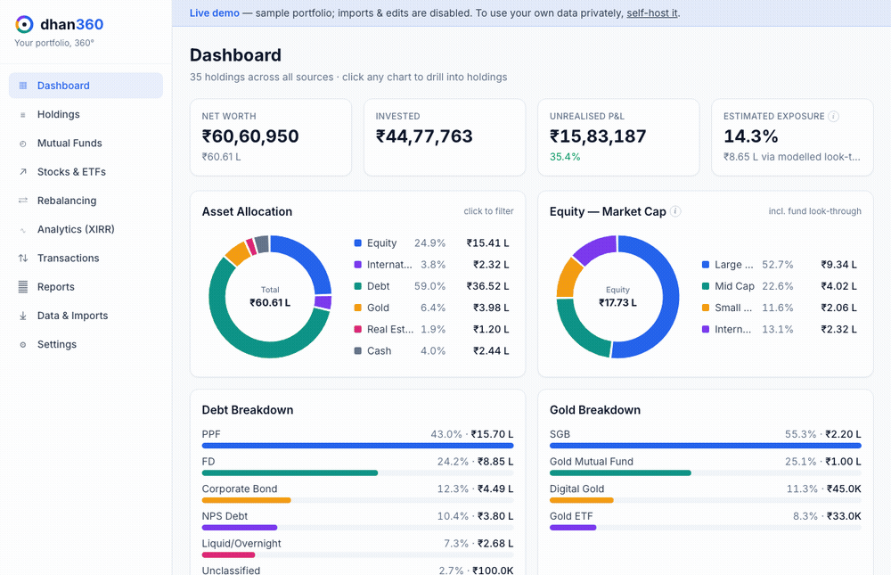
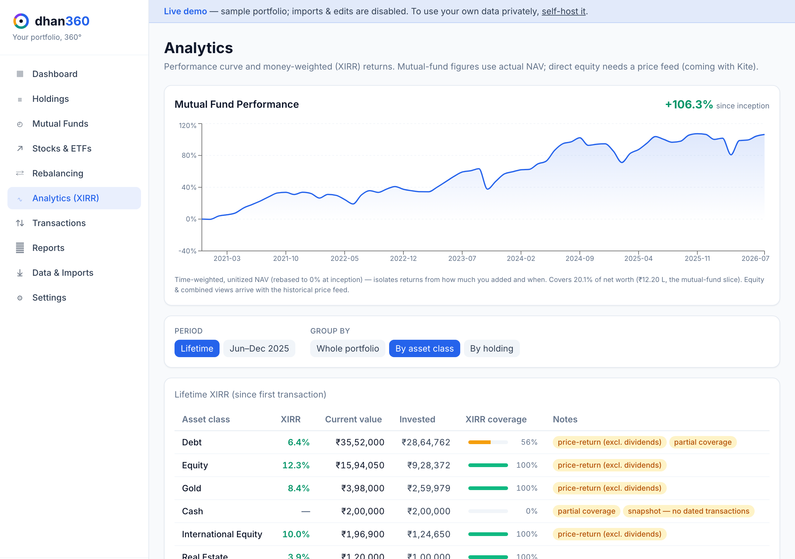
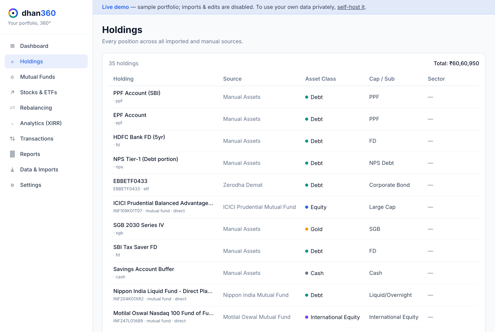
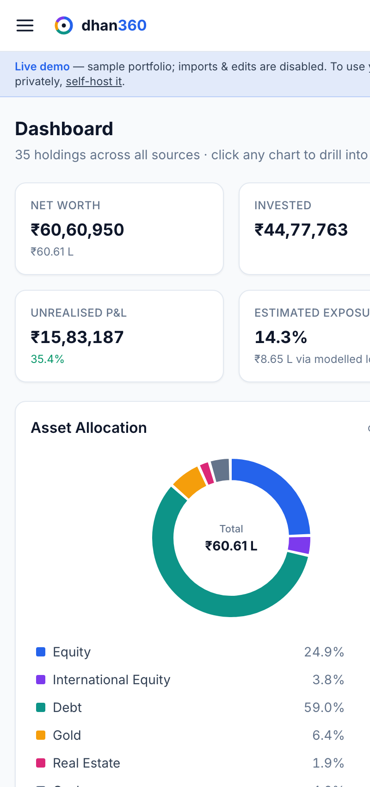

<div align="center">


# dhan<span>360</span>

**India-first, privacy-first portfolio analytics &amp; rebalancing for individual investors.**

[](LICENSE)
&nbsp;·&nbsp; [**🔎 Live demo →**](https://dhan360.in) &nbsp;·&nbsp; Self-hosted &nbsp;·&nbsp; No signup, nothing collected



<sub>Dashboard → click-to-filter → performance curve → funds → rebalancing → transactions</sub>

</div>

---

dhan360 gives an Indian retail investor a complete 360° view of their holdings across **mutual funds, direct stocks, ETFs, gold, debt, PPF, EPF, FDs, NPS, bonds, SGBs, REITs and manually-entered assets** — and helps them understand asset allocation, drift, and rebalancing. It is **not** a trading or robo-advisory tool; it's an analytics and visibility tool.

Everything runs **locally / self-hosted**. Your CAS PDFs, broker exports and holdings never leave your machine.

> ⚠️ dhan360 provides analytics only. It is **not investment advice**.

**🔎 Live demo:** [dhan360.in](https://dhan360.in) — explore a sample portfolio in your browser (no install, no signup, no data collected). To use your own data, self-host (below).

### Screenshots

| Analytics — performance curve & XIRR | Holdings (click-to-filter) | Mobile |
|---|---|---|
|  |  |  |

---

## What it does

Upload a **Zerodha holdings/tradebook CSV**, a **mutual-fund CAS** (PDF or casparser JSON), and add **manual assets** (PPF/FD/SGB/NPS…), and instantly see:

- **Net worth** across every imported & manual asset.
- **Asset allocation** — Equity, International Equity, Debt, Gold, Cash, Real Estate (REITs/InvITs), Others.
- **Equity cap split** — Large / Mid / Small / Micro / International / Unclassified, **including mutual-fund look-through** (a flexi-cap fund contributes partially to each cap, not as one blob).
- **Debt split** — Liquid/Overnight, Short Duration, Corporate Bond, Gilt/G-Sec, FD, PPF, NPS Debt, Cash.
- **Gold split** — Gold ETF, Gold Mutual Fund, SGB, Digital Gold.
- **Sector exposure** across direct stocks + fund look-through.
- **Stock concentration** and **direct-vs-fund overlap** (where fund portfolios are disclosed).
- **Current vs target allocation**, **drift**, and **rebalancing suggestions** (incl. a *new-money-only* mode and generic tax / exit-load reminders).

The dashboard is inspired by Zerodha Console: clean donut charts with hover (amount + %) and **click-to-filter** — click **Gold** to filter the holdings table to all gold assets, click **Mid Cap** to see every stock, ETF and fund contributing to mid-cap exposure.

### Transparent classification

dhan360 never just labels "all ETFs = equity". A gold ETF is **Gold**, a Bharat Bond / gilt ETF is **Debt**, an index ETF is **Equity**, a Nasdaq ETF is **International Equity**. Every classification carries a **confidence level** (`manual` / `high` / `medium` / `low` / `estimated`) and is shown in the UI, and you can set **remembered overrides** that apply everywhere. See [docs/CLASSIFICATION.md](docs/CLASSIFICATION.md).

---

## Tech stack

| Layer | Choice |
|---|---|
| Backend | **Python 3.12 · FastAPI · SQLAlchemy 2 · SQLite** (one local file) |
| CAS parsing | **casparser** (native CAMS/KFintech PDF, incl. password-protected) |
| Frontend | **React + Vite + TypeScript · Recharts · Tailwind** |
| Packaging | **Docker / docker-compose** (single self-host container) |

---

## Quick start

### Option A — Docker (recommended for self-hosting)

```bash
docker compose up --build
# open http://localhost:8000  → Data & Imports → "Load sample data"
```

Your data persists in `./data` (a local SQLite file).

### Option B — Local dev (two processes)

Prerequisites: Python 3.12 (e.g. via `pyenv`) and Node 20.

```bash
make setup          # create venv + install backend & frontend deps
make seed           # load the bundled sample portfolio (optional)

# terminal 1
make dev-backend    # FastAPI on http://localhost:8000

# terminal 2
make dev-frontend   # Vite on http://localhost:5173  (proxies /api to :8000)
```

Open **http://localhost:5173**. To run as a single process like production: `make build` then `make dev-backend` and open **http://localhost:8000**.

### Tests

```bash
make test           # parser + classification unit tests
```

---

## Importing your own data

| Source | How |
|---|---|
| Zerodha holdings | Console → Portfolio → Holdings → download CSV → upload as *Zerodha Holdings CSV* |
| Zerodha tradebook | Console → Reports → Tradebook → CSV → upload as *Zerodha Tradebook CSV* |
| Mutual fund CAS (PDF) | Get a CAS from CAMS/KFintech/MFCentral → upload as *CAS PDF* (enter the password, usually your PAN) |
| Mutual fund CAS (JSON) | `pip install casparser && casparser input.pdf -o cas.json` → upload the JSON |
| Anything else | Use the **Generic CSV template** (see [docs/IMPORT_FORMATS.md](docs/IMPORT_FORMATS.md)) |
| PPF / FD / SGB / NPS / bonds / REITs / cash | Add via **Manual entry** on the Imports page |

Sample/anonymized files live in [`samples/`](samples/). See [docs/IMPORT_FORMATS.md](docs/IMPORT_FORMATS.md) for exact column specs.

---

## Documentation

- [Architecture](docs/ARCHITECTURE.md) — modules, data model, import pipeline.
- [Classification methodology](docs/CLASSIFICATION.md) — how buckets, look-through and confidence work.
- [Import formats](docs/IMPORT_FORMATS.md) — supported files & the generic CSV template.
- [Limitations](docs/LIMITATIONS.md) — what's approximate, what's missing.
- [Roadmap](docs/ROADMAP.md) — PDF brokers, Groww/Kuvera/INDmoney, live prices, XIRR…
- [Contributing](CONTRIBUTING.md) — add a parser or extend reference data.

## Privacy

- All data lives in a local SQLite file (`DHAN360_DATA_DIR`, default `./data`). **Nothing is uploaded anywhere.**
- PDFs/CSVs are parsed by the backend process **you** run.
- `Data & Imports → Reset` wipes everything instantly.

## Licensing & hosted edition

dhan360 is **open source under the [GNU AGPL-3.0](LICENSE)** — you can self-host it free, forever,
and any modified version you run as a network service must share its source (AGPL §13).

Contributions are welcome under a lightweight **[Contributor License Agreement](CLA.md)**, which
keeps the project open source while letting the maintainers offer an optional **hosted/managed
edition** to fund development. A hosted version (if/when offered) is designed to preserve the same
privacy promise — see [the architecture notes](docs/ARCHITECTURE.md).

Built for the Indian investor community.
